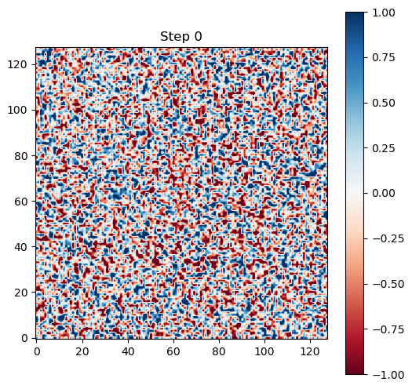
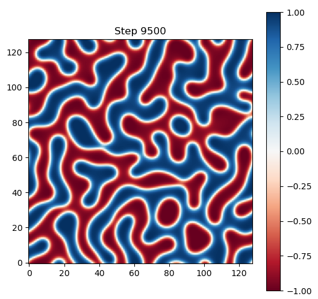

# CTL-Cahn-Hilliard model

The Cahn–Hilliard equation (after John W. Cahn and John E. Hilliard) is an equation of mathematical physics which describes the process of phase separation, spinodal decomposition, by which the two components of a binary fluid spontaneously separate and form domains pure in each component. Here we reproduce the original Cahn-Hilliard model as well as a number of variants. 

Within the 2D Cahn-Hilliard model for phase separation dynamics the time $t$ and position $(x,y)$-dependent concentration field $c(t,x,y)$ obeys the partial differential equation 

$$ \frac{\partial c}{\partial t} = M \nabla^2 \mu(c), \qquad \mu(c) = \frac{df(c)}{dc} - \kappa \nabla^2 c, $$

where $\mu(c)$ is the concentration-dependent chemical potential, $M$ is a mobility coefficient, $\kappa$ is a coefficient controling the interface width, $f(c)=(c^2-1)^2/4$ a double-well free energy, 
and $\nabla^2$ denotes the Laplace operator

  $$ \Delta = \frac{\partial^2}{\partial x^2} + \frac{\partial^2}{\partial y^2}. $$

The model is solved on a regular 2D grid with $N\times N$ spatial nodes, and grid spacing $\Delta x=1$. The Laplace operator is evaluated using one of its discretized versions such as 

$$\nabla^2 f(x,y) \approx \frac{f(x,y+1)+f(x+1,y)+f(x,y-1)+f(x-1,y)-4f(x,y))}{(\Delta x)^2}, $$

where periodic boundary conditions have to be taken into account, i.e., set $f(N+1,y)=f(1,y)$ etc. 

The grid is initialized with a random concentration field. At each time step of size $\Delta t=0.01$, update the concentration field by the discretized version of the dynamical equation, 

$$ c(t+\Delta t,x,y) = c(t,x,y) + \frac{\partial c(t,x,y)}{\partial t} \Delta t,$$

where you can insert the chemical potential evaluated at $c(t,x,y)$. In this setting, the concentration can take both negative and positive values, and the preferred concentrations are at $c=1$ and $c=-1$, as those concentrations are residing in the minima of $f(c)$.  

## Task 1

Write a routine that initializes $c(0,x,y)$ randomly and then calculates $c(t,x,y)$ for a duration of 10000 time steps (up to time $t=100$). Choose $M=1.0$, $\kappa=1.0$, and $N=128$. Visualize the concentration field in the course of time, by showing snapshots each 500 steps. Resulting frames at step 0 and step 10000 may look like this: 

  

Verify what happens if you begin with a constant $c(0,x,y)$, and if you begin with a $c(0,x,y)$ that is zero everywhere except on a single node. 

## Task 2 

The Cahn-Hilliard equation is a gradient flow of the free energy functional

$$ F(t) = \int f(c) + \frac{\kappa}{2} | \nabla c|^2 dxdy  $$

This implies mass conservation

$$ m(t) = \int c(t,x,y) dx dy = m(0)$$

and energy dissipation

$$ \frac{dF(t)}{dt} \le 0. $$

Test your code be evaluating the total mass $m(t)$ and the free energy $F(t)$. Plot both quantities versus time. 

## Task 3

Extract a characteristic length scale $L(t)$ present in the formed pattern. A standard way to do this is to inspect the isotropic structure factor, 

$$S(t,k) = | \hat{c}(t,k) |^2,$$

where $\hat{c}(t,k)$ is the Fourier-transform of $c(t,x,y)$, and find the wave number $k_\textrm{max}$ where $S(t,k_\textrm{max})$ reaches its maximum. This provides $k_\textrm{max}(t)$ in the course of time, and 

$$L(t) = \frac{2\pi}{k_\textrm{max}(t)}.$$

Certainly easier to implement is another method, where you count the number of sign changes of $c$ along vertical and horizontal grid lines to estimate $L(t)$. 

Measure $L(t)$ in the course of time and display it in a double-logarithmic plot. Does $L(t)$ increase with time? Find the growth exponent $\alpha$ and prefactor $A$ in the relationship 

$$L(t) = A t^\alpha,$$

evaluated at large times $t>100$. 

## Task 4 

Modify the free energy density and explore the behavior at least visually for different parameter choices.  Place snapshots into your report.md file. For each case, choose suitable initial $c(0,x,y)$. 

#### Asymmetric double well

$$f(c) = \frac{c^2-1)^2}{4} + \alpha c $$

Parameter $\alpha$. One phase is energetically preferred, shifts equilibrium composition, for alloy with off-stoichiometry, external field bias. You may choose $\alpha=1$.

#### Flory-Huggins free energy for polymers 

$$f(c) = c \ln(c) + (1-c)\ln(1-c) + \chi c(1-c)$$

Parameter $\chi$. Phase separation only if $\chi$ exceeds a threshold. Realistic for polymer blends and binary mixtures. For this case, $c$ must take values between 0 and 1. You may choose $\chi=2.5$.

#### Triple-well potential

$$f(c)=(c+1)^2 c^2(c-1)^2$$

Parameter-free. Three stable phases used in ternary alloys, multi-phase-field models, grain + liquid + void systems.

#### Non-convex + external field

$$f(c)=\frac{c^2-1)^2}{4}  - H c$$

Parameter $H$. Tilts energy landscape with external field $H$. Used in magnetism, biased phase separation, driven systems. You may choose $H=1$.

#### Periodic free energy (mathematically interesting)

$$f(c)=1-\cos(c)$$

## Possible extensions (not mandatory, for those interested in extensions/variations)

#### 3D simulation
#### Adaptive time stepping
#### Variable mobility M(c)
#### Anisotropic interfacial energy
#### GPU acceleration using CuPy
#### Finite-volume instead of finite-difference discretization
#### Semi-implicit Fourier solver (FFT)

